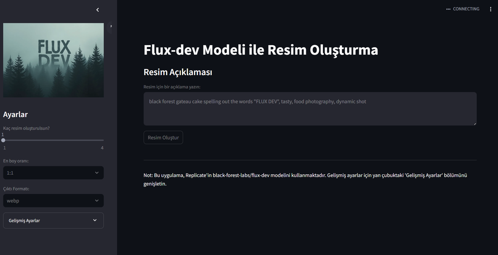

# Flux-dev Resim Oluşturma Uygulaması

Bu Streamlit uygulaması, Replicate'in black-forest-labs/flux-dev modelini kullanarak metin açıklamalarından resimler oluşturmanıza olanak tanır. Kullanıcı dostu bir arayüz ile çeşitli parametreleri ayarlayabilir ve özelleştirilmiş resimler oluşturabilirsiniz.



## Özellikler

- Metin açıklamalarından resim oluşturma
- Çoklu resim oluşturma (1-4 arası)
- Farklı en-boy oranları (1:1, 16:9, 9:16, 4:3, 3:4)
- Çıktı formatı seçimi (webp, jpg, png)
- Gelişmiş ayarlar (guidance, çıktı kalitesi, prompt gücü, inference adımları)
- Kullanıcı dostu Streamlit arayüzü

## Kurulum

1. Bu repository'yi klonlayın:
   ```
   git clone git@github.com:palamut62/Flux-Dev_-image.git
   cd texttoimageSA
   ```

2. (Opsiyonel) Sanal bir ortam oluşturun ve etkinleştirin:
   ```
   python -m venv venv
   source venv/bin/activate  # Unix veya MacOS
   venv\Scripts\activate  # Windows
   ```

3. Gerekli kütüphaneleri yükleyin:
   ```
   pip install -r requirements.txt
   ```

4. `.env` dosyası oluşturun ve Replicate API anahtarınızı ekleyin:
   ```
   REPLICATE_API_TOKEN=your_api_token_here
   ```

## Kullanım

1. Uygulamayı başlatın:
   ```
   streamlit run to_image.py
   ```

2. Web tarayıcınızda `http://localhost:8501` adresine gidin.

3. Yan çubukta bulunan ayarları kullanarak istediğiniz parametreleri seçin:
   - Oluşturulacak resim sayısı
   - En-boy oranı
   - Çıktı formatı
   - Gelişmiş ayarlar (expander içinde)

4. Ana sayfada bulunan metin alanına resim için bir açıklama yazın.

5. "Resim Oluştur" butonuna tıklayın ve sonuçları bekleyin.

6. Oluşturulan resimler sayfanın alt kısmında görüntülenecektir.

## Gelişmiş Ayarlar

Gelişmiş ayarlar, yan çubuktaki "Gelişmiş Ayarlar" expander'ı içinde bulunur:

- Guidance: Modelin açıklamaya ne kadar sıkı bağlı kalacağını belirler (1.0 - 20.0)
- Çıktı Kalitesi: Oluşturulan resmin kalitesini ayarlar (1 - 100)
- Prompt Gücü: Açıklamanın resim üzerindeki etkisini belirler (0.1 - 1.0)
- Inference Steps: Resim oluşturma işleminin adım sayısını belirler (20 - 50)

## Katkıda Bulunma

1. Bu repository'yi fork edin
2. Yeni bir branch oluşturun (`git checkout -b feature/AmazingFeature`)
3. Değişikliklerinizi commit edin (`git commit -m 'Add some AmazingFeature'`)
4. Branch'inizi push edin (`git push origin feature/AmazingFeature`)
5. Bir Pull Request oluşturun

## Lisans

Bu proje [MIT Lisansı](LICENSE) altında lisanslanmıştır.

## İletişim

Your Name - [palamut62](https://x.com/palamut62) - umutcelik6230@gmail.com

Project Link: [https://github.com/your-username/flux-dev-image-generator](https://github.com/your-username/flux-dev-image-generator)

## Teşekkürler

- [Streamlit](https://streamlit.io/)
- [Replicate](https://replicate.com/)
- [black-forest-labs/flux-dev model](https://replicate.com/black-forest-labs/flux-dev)
